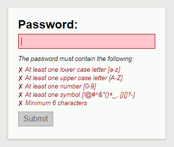

# Password Validator

> A live password validator with html and js 

## Contributing

1. Fork the project.
2. Create your feature branch: `git checkout -b my-new-feature`
3. Commit your changes: `git commit -am "Add some feature"`
4. Push your branch: `git push origin my-new-feature`
5. Open a pull request.

## Authors

* **Alex Scheitlin** - *Initial work* - [AlexScheitlin](https://github.com/AlexScheitlin)

## License

This project is licensed under the [MIT License](LICENSE).
